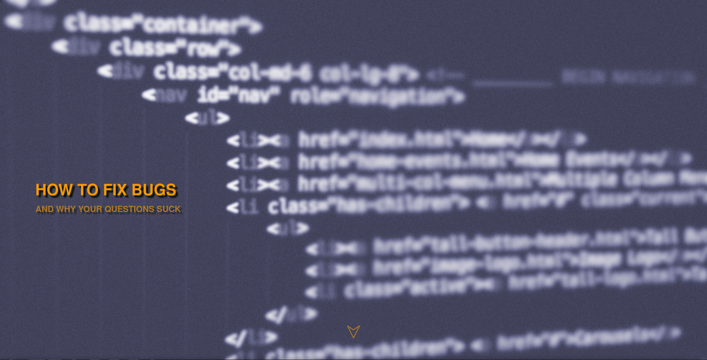
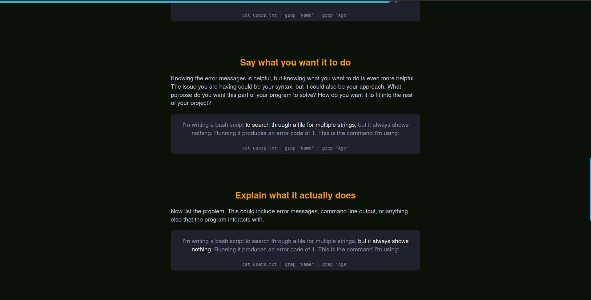

# Cs 260 Final project

Test of what could be done with just html and css. Note that this only works on full screen desktop as of now. I learned a lot about design, writting, and web development through this and hope you find it educational or interesting. 

## Inspiration
From our lesson in CSS, we were shown [CSS Zen Garden](https://www.csszengarden.com/) and I was so intrigued. It was incredible to see what they could do with such simple technologies. I find working with restrictions very interesting and fun and typically am drawn to minimalism. I decided to see what I could do with just one HTML and CSS file (excluding pictures).

## Compatability

The layout only works on full screen desktop browsers (1920x1080) as of now.
### Experimental/Newer Features
There is a modified scroll bar that requires either [Firefox version 64+](https://developer.mozilla.org/en-US/docs/Web/CSS/scrollbar-color) or is a non-standard feature in [Chrome 2+, Edge 79+, Opera 15+, or Safari 4+](https://developer.mozilla.org/en-US/docs/Web/CSS/::-webkit-scrollbar).

It also uses [scroll-timeline](https://developer.mozilla.org/en-US/docs/Web/CSS/scroll-timeline) feature which would need to be explicitly enabled by setting "layout.css.scroll-linked-animations.enabled" to true if you are using [Firefox](about:config), or by enabling the Experimental Features if you are using [Chrome](chrome://flags).

## Credits
All code and pictures are public domain or my own work

